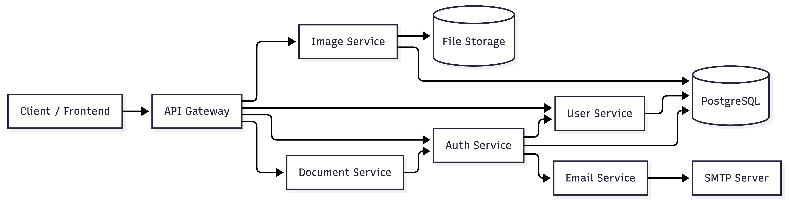

# Аналіз монолітної архітектури та мікросервісна схема

## Аналіз монолітного застосунку

### Основні модулі

| Модуль    | Призначення                                    |
| --------- | ---------------------------------------------- |
| auth      | Реєстрація, авторизація, JWT                   |
| users     | Робота з користувачами                         |
| images    | Завантаження, отримання та видалення зображень |
| documents | Генерація документів                           |
| email     | Надсилання email                               |
| database  | Підключення до PostgreSQL                      |
| server    | HTTP API та маршрути                           |
| config    | Конфігурація застосунку                        |

---

## Виявлені залежності

### Auth module

Використовує:

* users repository
* email service
* JWT middleware
* PostgreSQL

### Images module

Використовує:

* images repository
* storage/uploads
* PostgreSQL

### Documents module

Використовує:

* JWT middleware

### Email module

Використовується auth-модулем для:

* підтвердження
* повідомлень

---

# Мікросервісна архітектура

Для переходу до мікросервісної архітектури моноліт було розділено на незалежні сервіси.

## Виділені мікросервіси

| Сервіс           | Відповідальність                    |
| ---------------- | ----------------------------------- |
| API Gateway      | Єдина точка входу                   |
| Auth Service     | Авторизація, JWT, login/signup      |
| User Service     | Робота з користувачами              |
| Image Service    | Завантаження та отримання зображень |
| Document Service | Генерація документів                |
| Email Service    | Надсилання email                    |
| PostgreSQL       | Зберігання даних                    |
| File Storage     | Зберігання файлів                   |

---

# Діаграма сервісів

---

# Опис взаємодії сервісів

## API Gateway

Є центральною точкою входу.

Функції:

* маршрутизація запитів
* авторизація
* rate limiting
* logging

---

## Auth Service

Відповідає за:

* login
* signup
* JWT
* перевірку токенів

Взаємодіє з:

* User Service
* Email Service
* PostgreSQL

---

## User Service

Відповідає за:

* CRUD користувачів
* профілі
* дані користувачів

---

## Image Service

Відповідає за:

* upload image
* download image
* delete image

Використовує:

* PostgreSQL
* File Storage

---

## Document Service

Відповідає за:

* генерацію документів
* створення PDF/інших файлів

---

## Email Service

Окремий сервіс для:

* email notifications
* verification emails
* SMTP integration

---
